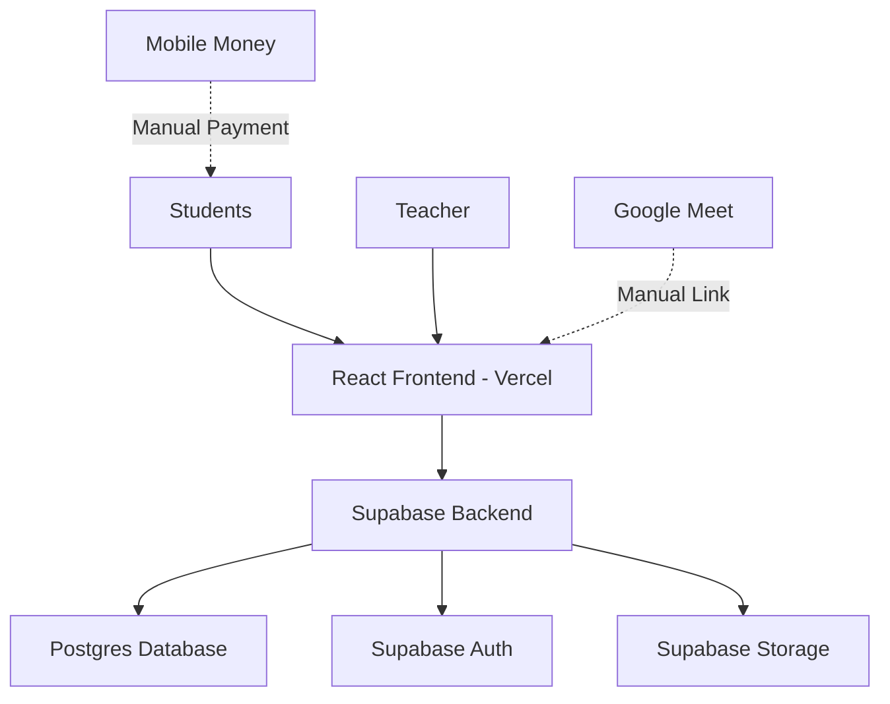
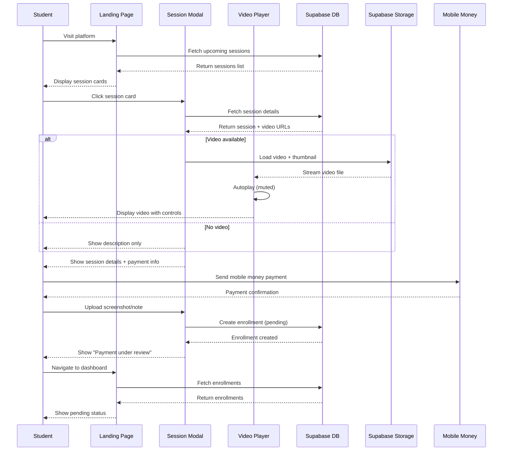
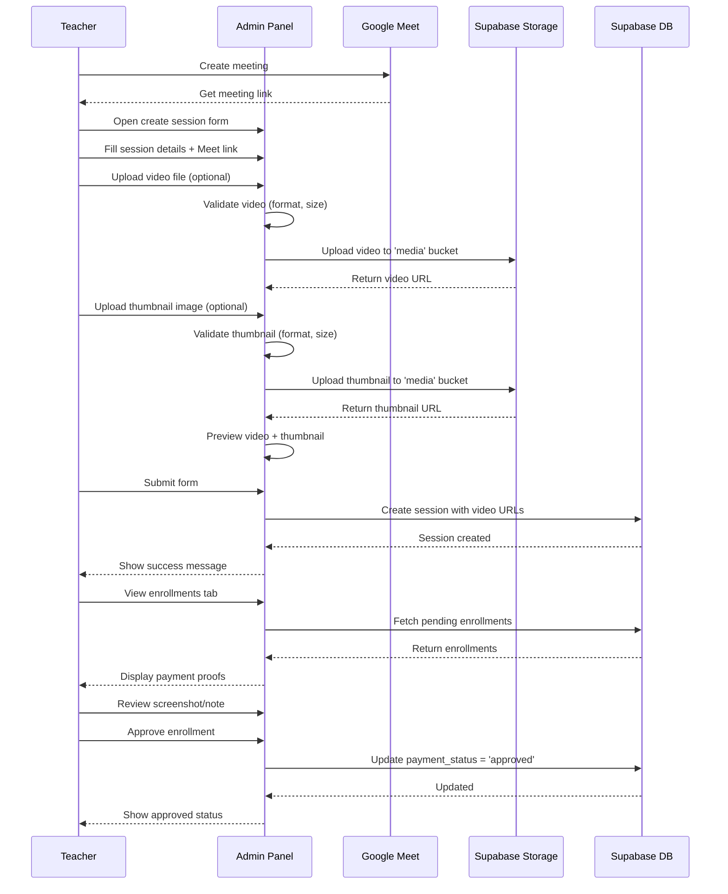
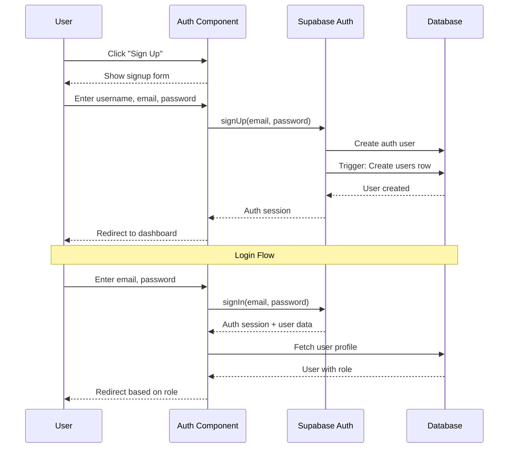
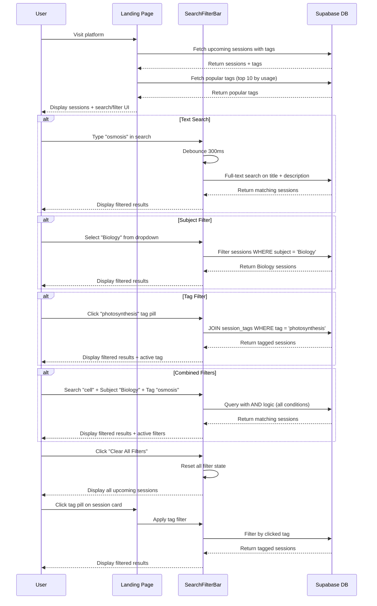
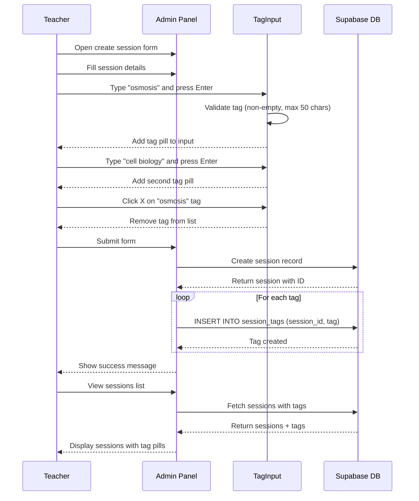
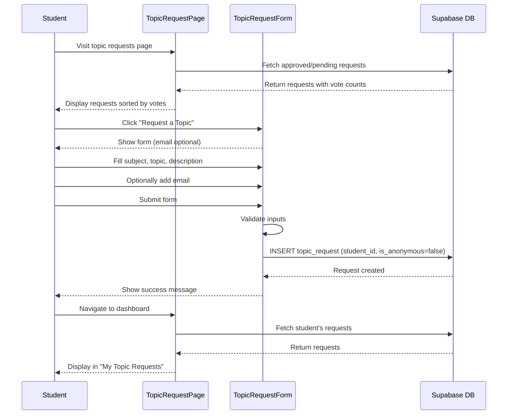
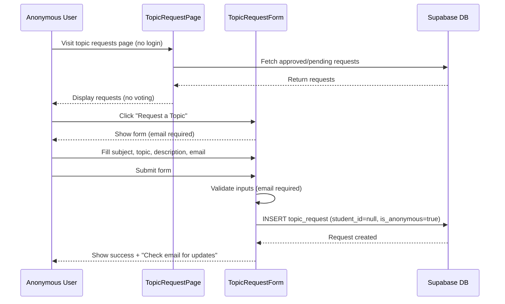
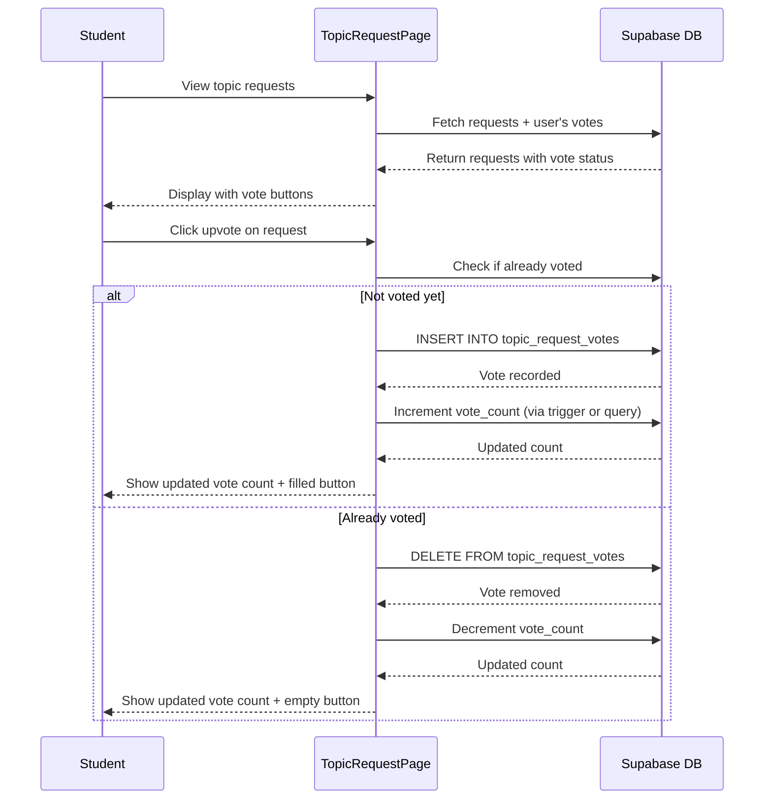
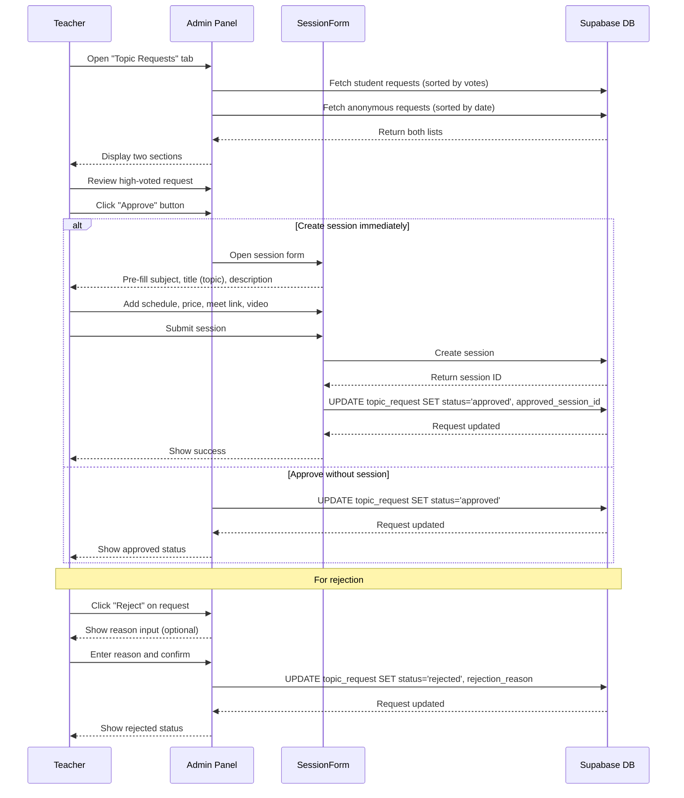

# Design Document: TrMato MVP Platform

## Overview

TrMato is a minimal live tutoring platform for secondary school students in Uganda. The MVP enables a teacher (Matovu) to create scheduled discussion sessions, students to browse and enroll in sessions via manual mobile money payment, and coordinate live meetings through embedded Google Meet links. The platform uses a trust-based payment verification system where students submit payment proof (screenshot or note) and the teacher manually approves enrollments.

This design focuses on delivering a working prototype within 1 hour using React, Supabase, and Vercel with zero infrastructure cost.

## Architecture



**Architecture Principles:**
- Single-page application with client-side routing
- Direct Supabase client integration (no custom backend)
- Serverless deployment on Vercel free tier
- Manual external integrations (Google Meet links, mobile money)

## Components and Interfaces

### Component 1: Authentication Module

**Purpose**: Handle user signup, login, and session management

**Interface**:
```javascript
// Auth Context
interface AuthContext {
  user: User | null
  signUp: (username, email, password) => Promise<void>
  signIn: (email, password) => Promise<void>
  signOut: () => Promise<void>
  resendConfirmation: (email) => Promise<{ data: object | null, error: Error | null }>
  loading: boolean
}

// User Model
interface User {
  id: string
  username: string
  email: string
  role: 'student' | 'teacher'
  created_at: string
}
```

**Responsibilities**:
- User registration with role assignment (default: student)
- Email/password authentication via Supabase Auth
- Session persistence across page reloads
- Protected route handling

### Component 2: Public Landing Page

**Purpose**: Display upcoming sessions to all visitors with search and filtering capabilities (no auth required)

**Interface**:
```javascript
interface LandingPage {
  sessions: Session[]
  filteredSessions: Session[]
  searchQuery: string
  selectedSubject: string | null
  selectedTags: string[]
  popularTags: string[]
  onSessionClick: (sessionId) => void
  onSearchChange: (query: string) => void
  onSubjectFilter: (subject: string | null) => void
  onTagFilter: (tag: string) => void
  onClearFilters: () => void
}

interface Session {
  id: string
  title: string
  subject: string
  description: string
  scheduled_at: string
  price_ugx: number
  status: 'upcoming' | 'completed' | 'cancelled'
  tags: string[]  // Array of tag names from session_tags table
}

interface SearchFilterState {
  searchText: string
  subjectFilter: string | null
  tagFilters: string[]
}
```

**Responsibilities**:
- Fetch and display all upcoming sessions with their tags
- Provide search bar for text search across titles and descriptions
- Provide subject filter dropdown (Biology, Physics, Chemistry, Mathematics, etc.)
- Display popular tags with click-to-filter functionality
- Apply combined filters (AND logic: search + subject + tags)
- Show active filters with individual and bulk clear options
- Show session cards with title, subject, date, price, and tag pills
- Open session detail modal on click
- Responsive grid layout (mobile-first)

### Component 3: Session Detail Modal

**Purpose**: Show full session information with explainer video, tags, and enrollment flow

**Interface**:
```javascript
interface SessionDetailModal {
  session: SessionDetail
  isOpen: boolean
  onClose: () => void
  onEnroll: (paymentProof) => Promise<void>
  onTagClick: (tag: string) => void
}

interface SessionDetail extends Session {
  meet_link: string
  payment_number: string
  payment_name: string
  created_by: string
  explainer_video: string | null
  video_thumbnail: string | null
  tags: string[]  // Array of tag names
}

interface PaymentProof {
  screenshot?: File
  note?: string
}
```

**Responsibilities**:
- Display explainer video at top of modal (if available)
- Autoplay video on modal open (muted)
- Show video thumbnail as poster image
- Provide responsive video player with standard controls
- Display complete session details below video
- Display tags as clickable pills below session title
- Handle tag click to filter sessions by that tag (closes modal and applies filter)
- Show payment instructions (mobile money number and name)
- Provide payment proof upload (screenshot or text note)
- Handle enrollment submission
- Show enrollment status if already enrolled
- Fallback to description-only layout if no video uploaded

### Component 4: Student Dashboard

**Purpose**: Display student's enrolled sessions, payment status, and topic requests

**Interface**:
```javascript
interface StudentDashboard {
  enrollments: Enrollment[]
  topicRequests: StudentTopicRequest[]
  onViewSession: (sessionId) => void
  onViewRequest: (requestId) => void
}

interface Enrollment {
  id: string
  session: Session
  payment_status: 'pending' | 'approved' | 'rejected'
  payment_screenshot: string | null
  payment_note: string | null
  enrolled_at: string
}

interface StudentTopicRequest {
  id: string
  subject: string
  topic: string
  description: string | null
  status: 'pending' | 'approved' | 'rejected'
  vote_count: number
  created_at: string
  approved_session_id: string | null  // Link to created session if approved
}
```

**Responsibilities**:
- List all student enrollments
- Show payment status badges (pending/approved/rejected)
- Display Google Meet link for approved enrollments
- Filter by upcoming vs past sessions
- Display "My Topic Requests" section
- Show topic request status badges (pending/approved/rejected)
- Show vote count for each request
- Link to created session if request was approved
- Sort requests by date (newest first)

### Component 5: Teacher Admin Panel

**Purpose**: Create sessions with video content and tags, manage enrollments and topic requests

**Interface**:
```javascript
interface AdminPanel {
  sessions: Session[]
  enrollments: Enrollment[]
  studentRequests: TopicRequest[]
  anonymousRequests: TopicRequest[]
  onCreateSession: (sessionData) => Promise<void>
  onUpdateEnrollment: (enrollmentId, status) => Promise<void>
  onUploadVideo: (file: File) => Promise<string>
  onUploadThumbnail: (file: File) => Promise<string>
  onApproveRequest: (requestId: string, sessionData?: SessionFormData) => Promise<void>
  onRejectRequest: (requestId: string, reason?: string) => Promise<void>
}

interface SessionFormData {
  title: string
  subject: string
  description: string
  scheduled_at: string
  price_ugx: number
  meet_link: string
  payment_number: string
  payment_name: string
  tags: string[]  // Array of tag names (e.g., ["osmosis", "cell biology"])
  explainer_video?: File
  video_thumbnail?: File
}

interface VideoUploadValidation {
  maxVideoSize: 50 * 1024 * 1024  // 50MB
  maxThumbnailSize: 2 * 1024 * 1024  // 2MB
  allowedVideoFormats: ['video/mp4', 'video/webm']
  allowedImageFormats: ['image/jpeg', 'image/png']
}

interface TagInputComponent {
  tags: string[]
  onAddTag: (tag: string) => void
  onRemoveTag: (tag: string) => void
  placeholder: string
  maxTags?: number  // Optional limit (e.g., 10)
}

interface TopicRequest {
  id: string
  student_id: string | null
  subject: string
  topic: string
  description: string | null
  email: string | null
  status: 'pending' | 'approved' | 'rejected'
  vote_count: number
  is_anonymous: boolean
  created_at: string
}
```

**Responsibilities**:
- Create new sessions with form validation
- Provide tag input field (comma-separated or chip input style)
- Allow adding/removing multiple tags per session
- Validate tags (non-empty, max length 50 chars per tag)
- Upload video files to Supabase Storage (max 50MB)
- Upload thumbnail images to Supabase Storage (max 2MB)
- Validate video format (MP4, WebM) and file size
- Validate thumbnail format (JPG, PNG) and file size
- Preview uploaded video and thumbnail before submission
- List all sessions created by teacher with their tags
- View enrollments per session
- Approve/reject payment submissions
- View payment proof (screenshot or note)
- Display "Topic Requests" tab with two sections:
  - "Student Requests" (authenticated, sorted by votes)
  - "Anonymous Requests" (anonymous, sorted by date)
- Show request details: subject, topic, description, email, vote count
- Approve requests (optionally auto-fill session creation form)
- Reject requests with optional reason
- Link approved requests to created sessions

### Component 6: TagPill Component

**Purpose**: Display individual tags as clickable pills for filtering

**Interface**:
```javascript
interface TagPill {
  tag: string
  onClick?: (tag: string) => void
  onRemove?: (tag: string) => void
  variant: 'default' | 'active' | 'removable'
  size: 'small' | 'medium'
}
```

**Responsibilities**:
- Render tag as styled pill/badge
- Handle click events for filtering (when clickable)
- Show remove icon for removable variant (in tag input)
- Apply active styling when tag is in active filters
- Responsive sizing for mobile and desktop

### Component 7: SearchFilterBar Component

**Purpose**: Provide unified search and filter controls

**Interface**:
```javascript
interface SearchFilterBar {
  searchQuery: string
  selectedSubject: string | null
  selectedTags: string[]
  popularTags: string[]
  subjects: string[]
  onSearchChange: (query: string) => void
  onSubjectChange: (subject: string | null) => void
  onTagToggle: (tag: string) => void
  onClearFilters: () => void
  hasActiveFilters: boolean
}
```

**Responsibilities**:
- Render search input with debounced text search
- Render subject dropdown filter
- Display popular tags as clickable pills
- Show active filters with clear buttons
- Provide "Clear All Filters" button when filters active
- Responsive layout (stack on mobile, horizontal on desktop)

### Component 8: TopicRequestPage Component

**Purpose**: Public page for browsing and submitting topic requests

**Interface**:
```javascript
interface TopicRequestPage {
  topicRequests: TopicRequest[]
  userVotes: string[]  // Array of request IDs user has voted for
  isAuthenticated: boolean
  currentUserId: string | null
  onSubmitRequest: (requestData: TopicRequestFormData) => Promise<void>
  onUpvote: (requestId: string) => Promise<void>
  onRemoveVote: (requestId: string) => Promise<void>
}

interface TopicRequest {
  id: string
  subject: string
  topic: string
  description: string | null
  vote_count: number
  status: 'pending' | 'approved' | 'rejected'
  created_at: string
  is_anonymous: boolean
  student_id: string | null
}
```

**Responsibilities**:
- Display all approved and pending student requests (not anonymous)
- Sort requests by vote count (most voted first)
- Show vote count for each request
- Allow authenticated students to upvote/remove vote (one vote per request)
- Highlight requests user has already voted for
- Display topic request submission form
- Handle both authenticated and anonymous submissions
- Show status badges (pending/approved)
- Responsive grid layout

### Component 9: TopicRequestForm Component

**Purpose**: Form for submitting topic requests (authenticated and anonymous)

**Interface**:
```javascript
interface TopicRequestForm {
  isAuthenticated: boolean
  onSubmit: (data: TopicRequestFormData) => Promise<void>
  onCancel?: () => void
}

interface TopicRequestFormData {
  subject: string
  topic: string
  description: string
  email?: string  // Required for anonymous, optional for authenticated
}

interface TopicRequestValidation {
  subjectRequired: true
  topicRequired: true
  topicMinLength: 5
  topicMaxLength: 200
  descriptionMaxLength: 1000
  emailRequiredForAnonymous: true
  emailFormat: /^[^\s@]+@[^\s@]+\.[^\s@]+$/
}
```

**Responsibilities**:
- Render form fields: subject dropdown, topic input, description textarea
- Show email field (required for anonymous, optional for authenticated)
- Validate all inputs before submission
- Display validation errors inline
- Handle form submission for both user types
- Clear form after successful submission
- Show success/error messages

## Data Models

### Model 1: users

```javascript
interface UsersTable {
  id: string              // UUID, primary key
  username: string        // Unique, not null
  email: string          // Unique, not null
  role: string           // 'student' | 'teacher', default 'student'
  created_at: string     // Timestamp
}
```

**Validation Rules**:
- Email must be valid format
- Username must be 3-30 characters
- Role must be 'student' or 'teacher'
- Email and username must be unique

**Supabase Setup**:
- Linked to Supabase Auth users via trigger
- Row Level Security (RLS) enabled
- Users can read their own data only

### Model 2: sessions

```javascript
interface SessionsTable {
  id: string              // UUID, primary key
  title: string          // Not null, max 200 chars
  subject: string        // Not null (e.g., "Mathematics", "Physics")
  description: string    // Text, not null
  meet_link: string      // Google Meet URL
  scheduled_at: string   // Timestamp, not null
  price_ugx: number      // Integer, not null, min 0
  payment_number: string // Mobile money number
  payment_name: string   // Account holder name
  status: string         // 'upcoming' | 'completed' | 'cancelled'
  explainer_video: string | null  // URL to Supabase Storage (nullable)
  video_thumbnail: string | null  // URL to Supabase Storage (nullable)
  created_by: string     // UUID, foreign key to users.id
  created_at: string     // Timestamp
}
```

**Validation Rules**:
- Title required, 10-200 characters
- Subject required
- Description required, min 20 characters
- scheduled_at must be future date
- price_ugx must be positive integer
- meet_link must be valid URL
- status defaults to 'upcoming'
- explainer_video must be valid Supabase Storage URL if provided
- video_thumbnail must be valid Supabase Storage URL if provided
- explainer_video and video_thumbnail are optional (nullable)

**Supabase Setup**:
- RLS: Public read for upcoming sessions (including video URLs)
- RLS: Only teachers can create/update their own sessions
- Index on scheduled_at and status for filtering
- Index on subject for subject filtering
- Full-text search index on (title, description) for text search
- Storage bucket 'media' configured for public access
- Storage path structure: media/videos/{session_id}/{filename}
- Storage path structure: media/thumbnails/{session_id}/{filename}

### Model 3: enrollments

```javascript
interface EnrollmentsTable {
  id: string                  // UUID, primary key
  session_id: string          // UUID, foreign key to sessions.id
  student_id: string          // UUID, foreign key to users.id
  payment_status: string      // 'pending' | 'approved' | 'rejected'
  payment_screenshot: string  // URL to Supabase Storage (nullable)
  payment_note: string        // Text note (nullable)
  enrolled_at: string         // Timestamp
}
```

**Validation Rules**:
- One enrollment per student per session (unique constraint)
- Either payment_screenshot or payment_note must be provided
- payment_status defaults to 'pending'
- student_id must reference existing user with role 'student'

**Supabase Setup**:
- RLS: Students can create and read their own enrollments
- RLS: Teachers can read/update enrollments for their sessions
- Unique constraint on (session_id, student_id)
- Foreign key cascades on delete

### Model 4: session_tags

```javascript
interface SessionTagsTable {
  id: string          // UUID, primary key
  session_id: string  // UUID, foreign key to sessions.id
  tag: string         // Text, not null, max 50 chars
  created_at: string  // Timestamp
}
```

**Validation Rules**:
- tag must be non-empty string
- tag max length 50 characters
- tag should be lowercase and trimmed
- Multiple tags allowed per session
- Duplicate tags for same session prevented (unique constraint)

**Supabase Setup**:
- RLS: Public read access for all tags
- RLS: Only session owner (teacher) can create/delete tags
- Index on tag column for fast filtering
- Index on session_id for fast tag lookup per session
- Unique constraint on (session_id, tag) to prevent duplicates
- Foreign key cascade delete (when session deleted, tags deleted)
- Full-text search index on tag for autocomplete (optional)

### Model 5: topic_requests

```javascript
interface TopicRequestsTable {
  id: string              // UUID, primary key
  student_id: string      // UUID, foreign key to users.id, NULLABLE
  subject: string         // Text, not null
  topic: string           // Text, not null, max 200 chars
  description: string     // Text, nullable, max 1000 chars
  email: string           // Text, nullable
  status: string          // 'pending' | 'approved' | 'rejected', default 'pending'
  is_anonymous: boolean   // Boolean, default false
  approved_session_id: string  // UUID, foreign key to sessions.id, nullable
  rejection_reason: string     // Text, nullable
  created_at: string      // Timestamp
}
```

**Validation Rules**:
- subject required, non-empty
- topic required, 5-200 characters
- description optional, max 1000 characters
- email required if student_id is null (anonymous)
- email must be valid format if provided
- status defaults to 'pending'
- is_anonymous defaults to false
- student_id null for anonymous requests
- approved_session_id set when request is approved and session created
- rejection_reason optional, set when request is rejected

**Supabase Setup**:
- RLS: Public insert access (for anonymous submissions)
- RLS: Authenticated students can insert with their student_id
- RLS: Students can read their own requests (student_id matches)
- RLS: Teachers can read all requests
- RLS: Only teachers can update status, approved_session_id, rejection_reason
- RLS: Public read for approved and pending non-anonymous requests (for voting page)
- Index on status for filtering
- Index on student_id for student dashboard queries
- Index on is_anonymous for separating student vs anonymous requests
- Index on created_at for sorting
- Foreign key to users.id (nullable, no cascade)
- Foreign key to sessions.id (nullable, set on approval)

### Model 6: topic_request_votes

```javascript
interface TopicRequestVotesTable {
  id: string              // UUID, primary key
  request_id: string      // UUID, foreign key to topic_requests.id
  student_id: string      // UUID, foreign key to users.id
  created_at: string      // Timestamp
}
```

**Validation Rules**:
- One vote per student per request (unique constraint)
- Only authenticated students can vote (student_id required)
- student_id must reference existing user with role 'student'
- request_id must reference existing topic request

**Supabase Setup**:
- RLS: Authenticated students can insert votes
- RLS: Students can delete their own votes (remove vote)
- RLS: Public read access for vote counts
- Unique constraint on (request_id, student_id)
- Foreign key cascade delete (when request deleted, votes deleted)
- Foreign key cascade delete (when user deleted, votes deleted)
- Index on request_id for fast vote counting
- Index on student_id for checking user's votes

## User Flows

### Video Player Implementation Details

**HTML5 Video Element Configuration**:
```javascript
interface VideoPlayerConfig {
  autoplay: true
  muted: true
  controls: true
  playsInline: true  // For iOS Safari
  preload: 'metadata'
  poster: string  // video_thumbnail URL
  className: 'w-full max-w-full h-auto'  // Responsive styling
}

// Video player component structure
function VideoPlayer({ videoUrl, thumbnailUrl }) {
  return (
    <video
      src={videoUrl}
      poster={thumbnailUrl}
      autoPlay
      muted
      controls
      playsInline
      preload="metadata"
      className="w-full max-w-full h-auto rounded-lg"
      onError={(e) => handleVideoError(e)}
    >
      Your browser does not support the video tag.
    </video>
  )
}
```

**Mobile Responsiveness**:
- Video container: `max-width: 100%`, `height: auto`
- Aspect ratio maintained automatically by browser
- Touch-friendly controls on mobile devices
- Full-screen button available on all devices
- Minimum height on small screens: 200px

**Autoplay Behavior**:
- Autoplay only works when muted (browser policy)
- Video starts playing when modal opens
- User can unmute and control playback
- If autoplay fails (browser blocks), show play button

**Performance Optimization**:
- Use `preload="metadata"` to load only video metadata initially
- Lazy load video when modal opens (not on page load)
- Thumbnail displayed immediately as poster image
- Video streams from Supabase Storage (no full download required)

## User Flows

### Flow 1: Student Enrollment Journey with Video Viewing



### Flow 2: Teacher Session Creation with Video Upload



### Flow 3: Authentication Flow



### Flow 4: Search and Filter Sessions



### Flow 5: Teacher Creates Session with Tags



### Flow 6: Student Submits Topic Request (Authenticated)



### Flow 7: Anonymous User Submits Topic Request



### Flow 8: Student Upvotes Topic Request



### Flow 9: Teacher Reviews and Approves Topic Request



## Correctness Properties

*A property is a characteristic or behavior that should hold true across all valid executions of a system—essentially, a formal statement about what the system should do. Properties serve as the bridge between human-readable specifications and machine-verifiable correctness guarantees.*

### Property 1: Default Student Role Assignment

*For any* user signup with valid username, email, and password, the created user account should have role 'student' by default.

**Validates: Requirements 1.1**

### Property 2: Session Persistence Across Reloads

*For any* authenticated user, reloading the page should maintain their authentication session without requiring re-login.

**Validates: Requirements 1.3**

### Property 3: Email Format Validation

*For any* string submitted as an email address, the system should accept only strings matching valid email format (contains @, valid domain structure).

**Validates: Requirements 1.5**

### Property 4: Username Length Validation

*For any* string submitted as a username, the system should accept only strings with length between 3 and 30 characters inclusive.

**Validates: Requirements 1.6**

### Property 5: Email Uniqueness Enforcement

*For any* two users in the system, their email addresses should be distinct (no duplicates allowed).

**Validates: Requirements 1.7**

### Property 6: Username Uniqueness Enforcement

*For any* two users in the system, their usernames should be distinct (no duplicates allowed).

**Validates: Requirements 1.8**

### Property 7: Upcoming Session Filtering

*For any* session displayed on the Landing_Page, that session's status should equal 'upcoming'.

**Validates: Requirements 2.1**

### Property 8: Session Card Required Fields

*For any* session card rendered on the Landing_Page, the rendered output should contain the session's title, subject, scheduled date, and price.

**Validates: Requirements 2.2**

### Property 9: Video Player Conditional Rendering

*For any* session where explainer_video is not null, opening the Session_Modal should render a video element in the DOM.

**Validates: Requirements 3.1**

### Property 10: Video Autoplay Configuration

*For any* video player rendered in a Session_Modal, the video element should have both autoplay and muted attributes set to true.

**Validates: Requirements 3.2**

### Property 11: Video Thumbnail as Poster

*For any* session where both explainer_video and video_thumbnail are not null, the video element's poster attribute should equal the video_thumbnail URL.

**Validates: Requirements 3.3**

### Property 12: Video Player Controls Presence

*For any* video player rendered in a Session_Modal, the video element should have the controls attribute set to true.

**Validates: Requirements 3.4**

### Property 13: Video PlaysInline Attribute

*For any* video player rendered in a Session_Modal, the video element should have the playsInline attribute set to true for mobile compatibility.

**Validates: Requirements 3.5**

### Property 14: No Video Player Without Video

*For any* session where explainer_video is null, opening the Session_Modal should not render a video element in the DOM.

**Validates: Requirements 3.6**

### Property 15: Video Preload Optimization

*For any* video player rendered in a Session_Modal, the video element should have preload attribute set to 'metadata'.

**Validates: Requirements 3.9, 12.4**

### Property 16: Payment Proof Requirement

*For any* enrollment submission, the system should require that either payment_screenshot or payment_note (or both) is provided.

**Validates: Requirements 4.2, 9.2**

### Property 17: Enrollment Initial Status

*For any* successfully created enrollment, the payment_status should be set to 'pending'.

**Validates: Requirements 4.3**

### Property 18: Enrollment Uniqueness

*For any* student and session pair, at most one enrollment should exist in the system (no duplicate enrollments allowed).

**Validates: Requirements 4.4, 4.7**

### Property 19: Student Enrollment Filtering

*For any* student viewing their Student_Dashboard, all displayed enrollments should belong to that student (student_id matches authenticated user).

**Validates: Requirements 5.1**

### Property 20: Meet Link Conditional Visibility

*For any* enrollment displayed on Student_Dashboard, the meet_link should be visible if and only if payment_status equals 'approved'.

**Validates: Requirements 5.3, 5.4, 13.9**

### Property 21: Enrollment Status Badge Rendering

*For any* enrollment displayed on Student_Dashboard, a status badge element should be rendered containing the payment_status value.

**Validates: Requirements 5.5**

### Property 22: Session Title Length Validation

*For any* session creation submission, the system should accept only titles with length between 10 and 200 characters inclusive.

**Validates: Requirements 6.3**

### Property 23: Session Description Minimum Length

*For any* session creation submission, the system should accept only descriptions with length of at least 20 characters.

**Validates: Requirements 6.4**

### Property 24: Future Date Validation

*For any* session creation submission, the system should accept only scheduled_at values that are in the future relative to submission time.

**Validates: Requirements 6.5**

### Property 25: Positive Price Validation

*For any* session creation submission, the system should accept only price values that are positive integers (greater than zero, no decimals).

**Validates: Requirements 6.6**

### Property 26: URL Format Validation

*For any* meet_link submitted in session creation, the system should accept only strings matching valid URL format (protocol + domain).

**Validates: Requirements 6.7**

### Property 27: Video Format Validation

*For any* file uploaded as explainer_video, the system should accept only files with MIME type 'video/mp4' or 'video/webm'.

**Validates: Requirements 6.8**

### Property 28: Video File Size Limit

*For any* file uploaded as explainer_video, the system should accept only files with size less than or equal to 50MB (52,428,800 bytes).

**Validates: Requirements 6.9**

### Property 29: Thumbnail Format Validation

*For any* file uploaded as video_thumbnail, the system should accept only files with MIME type 'image/jpeg' or 'image/png'.

**Validates: Requirements 6.10**

### Property 30: Thumbnail File Size Limit

*For any* file uploaded as video_thumbnail, the system should accept only files with size less than or equal to 2MB (2,097,152 bytes).

**Validates: Requirements 6.11**

### Property 31: Video Upload Round Trip

*For any* valid video and thumbnail files uploaded during session creation, the files should be stored in Supabase Storage and the resulting public URLs should be stored in the session record's explainer_video and video_thumbnail fields.

**Validates: Requirements 6.12**

### Property 32: Thumbnail Without Video Rejection

*For any* session creation submission where video_thumbnail is provided but explainer_video is not, the system should display a warning and not upload the thumbnail.

**Validates: Requirements 6.13**

### Property 33: Default Session Status

*For any* newly created session, the session_status should be set to 'upcoming' by default.

**Validates: Requirements 6.16**

### Property 34: Teacher Session Ownership Filtering

*For any* teacher viewing their Admin_Panel, all displayed sessions should have created_by equal to that teacher's user ID.

**Validates: Requirements 7.1**

### Property 35: Payment Status Transition on Approval

*For any* enrollment where a teacher performs an approval action, the payment_status should transition from its current value to 'approved'.

**Validates: Requirements 7.6**

### Property 36: Payment Status Transition on Rejection

*For any* enrollment where a teacher performs a rejection action, the payment_status should transition from its current value to 'rejected'.

**Validates: Requirements 7.7**

### Property 37: Session Enrollment Authorization

*For any* session, only the teacher with user ID equal to the session's created_by field should be able to view and modify enrollments for that session.

**Validates: Requirements 7.8**

### Property 38: Student Admin Panel Access Denial

*For any* authenticated user with role 'student', attempting to access the Admin_Panel route should result in redirect to Student_Dashboard.

**Validates: Requirements 8.1**

### Property 39: Teacher Dashboard Redirect

*For any* authenticated user with role 'teacher', attempting to access the Student_Dashboard route should result in redirect to Admin_Panel.

**Validates: Requirements 8.2**

### Property 40: Student Session Modification Prevention

*For any* user with role 'student', attempts to create, update, or delete session records should be rejected by Row Level Security policies.

**Validates: Requirements 8.4**

### Property 41: Student Enrollment Isolation

*For any* user with role 'student', database queries for enrollments should return only enrollments where student_id equals that user's ID.

**Validates: Requirements 8.5**

### Property 42: Teacher Session Modification Authorization

*For any* user with role 'teacher', attempts to update or delete a session should succeed only if the session's created_by equals that user's ID.

**Validates: Requirements 8.6**

### Property 43: Public Upcoming Session Access

*For any* unauthenticated user, database queries for sessions where session_status equals 'upcoming' should succeed and return results.

**Validates: Requirements 8.7**

### Property 44: Enrollment Foreign Key Integrity

*For any* enrollment record, the student_id must reference an existing user with role 'student' and session_id must reference an existing session.

**Validates: Requirements 9.1**

### Property 45: Session Status Enum Validation

*For any* session record, the session_status value should be one of 'upcoming', 'completed', or 'cancelled'.

**Validates: Requirements 9.3**

### Property 46: Payment Status Enum Validation

*For any* enrollment record, the payment_status value should be one of 'pending', 'approved', or 'rejected'.

**Validates: Requirements 9.4**

### Property 47: User Role Enum Validation

*For any* user record, the role value should be either 'student' or 'teacher'.

**Validates: Requirements 9.5**

### Property 48: Cascade Delete Enrollments

*For any* session that is deleted, all enrollment records where session_id equals the deleted session's ID should also be deleted.

**Validates: Requirements 9.6**

### Property 49: Video Storage Bucket Assignment

*For any* file uploaded as explainer_video, the file should be stored in the Supabase Storage bucket named 'media' and the resulting URL should contain 'media/videos/'.

**Validates: Requirements 10.1**

### Property 50: Thumbnail Storage Bucket Assignment

*For any* file uploaded as video_thumbnail, the file should be stored in the Supabase Storage bucket named 'media' and the resulting URL should contain 'media/thumbnails/'.

**Validates: Requirements 10.2**

### Property 51: Payment Screenshot Storage Bucket Assignment

*For any* file uploaded as payment_screenshot, the file should be stored in the Supabase Storage bucket named 'payment-proofs'.

**Validates: Requirements 10.3**

### Property 52: Public Media Bucket Access

*For any* file stored in the 'media' bucket, unauthenticated HTTP GET requests to the file's public URL should succeed and return the file content.

**Validates: Requirements 10.4**

### Property 53: Teacher Media Upload Authorization

*For any* authenticated user with role 'teacher', file upload requests to the 'media' bucket should succeed; for users with role 'student' or unauthenticated users, uploads should be rejected.

**Validates: Requirements 10.5**

### Property 54: Student Payment Proof Upload Authorization

*For any* authenticated user with role 'student', file upload requests to the 'payment-proofs' bucket should succeed; for users with role 'teacher' or unauthenticated users, uploads should be rejected.

**Validates: Requirements 10.7**

### Property 55: Payment Proof Access Control

*For any* file stored in the 'payment-proofs' bucket, read access should be granted only to the student who uploaded it (enrollment owner) and the teacher who owns the associated session.

**Validates: Requirements 10.8, 13.7**

### Property 56: Video File Path Structure

*For any* video file uploaded to the 'media' bucket, the storage path should match the pattern: media/videos/{session_id}/{timestamp}_{filename}.

**Validates: Requirements 10.9**

### Property 57: Thumbnail File Path Structure

*For any* thumbnail file uploaded to the 'media' bucket, the storage path should match the pattern: media/thumbnails/{session_id}/{timestamp}_{filename}.

**Validates: Requirements 10.10**

### Property 58: Form Validation State Persistence

*For any* form submission that fails validation, the form should remain open (not close or reset) and invalid fields should be visually highlighted.

**Validates: Requirements 11.12**

### Property 59: Session List Caching

*For any* two requests to fetch the session list within a 5-minute window, the second request should be served from cache without querying the database.

**Validates: Requirements 12.1**

### Property 60: Session Modal Lazy Loading

*For any* page load of the Landing_Page, video content should not be fetched until a Session_Modal is opened.

**Validates: Requirements 12.2**

### Property 61: Enrollment Pagination

*For any* page of enrollments displayed in the Student_Dashboard or Admin_Panel, the page should contain at most 20 enrollment records.

**Validates: Requirements 12.3**

### Property 62: Bandwidth Monitoring Warning

*For any* month where cumulative video streaming bandwidth approaches 2GB, the system should log a warning message for monitoring purposes.

**Validates: Requirements 12.8**

### Property 63: XSS Input Sanitization

*For any* user-provided text input (titles, descriptions, notes), the system should sanitize the input to remove or escape HTML tags and JavaScript code before storing or rendering.

**Validates: Requirements 13.4**

### Property 64: File MIME Type Verification

*For any* file upload, the system should verify that the file's actual MIME type matches its declared MIME type and reject mismatches.

**Validates: Requirements 13.5**

### Property 65: File Extension Validation

*For any* file upload, the system should validate that the file extension matches the allowed extensions for that file type and reject invalid extensions.

**Validates: Requirements 13.6**

### Property 66: User Data Deletion

*For any* user who requests data deletion, the system should remove all associated user records, enrollments, and uploaded files from the database and storage.

**Validates: Requirements 13.10**

### Property 67: Video Fullscreen Support

*For any* video player rendered in a Session_Modal, the video element should support the browser's fullscreen API (fullscreen button available in controls).

**Validates: Requirements 14.7**

### Property 68: Autoplay Fallback

*For any* video player where autoplay is blocked by browser policy, the system should display a visible play button to allow manual video start.

**Validates: Requirements 14.8**

### Property 69: Tag Storage on Session Creation

*For any* session created with a non-empty tags array, each tag in the array should result in a corresponding row in the session_tags table with that session's ID.

**Validates: Requirements 15.1**

### Property 70: Tag Length Validation

*For any* tag submitted in session creation or update, the system should accept only tags with length between 1 and 50 characters inclusive.

**Validates: Requirements 15.2**

### Property 71: Tag Uniqueness Per Session

*For any* session, no two rows in session_tags with that session_id should have the same tag value (case-insensitive).

**Validates: Requirements 15.3**

### Property 72: Tag Lowercase Normalization

*For any* tag stored in session_tags, the tag value should be lowercase and trimmed of leading/trailing whitespace.

**Validates: Requirements 15.4**

### Property 73: Session Tags Join Query

*For any* session displayed on Landing_Page, the session object should include a tags array populated by joining with session_tags table on session_id.

**Validates: Requirements 15.5**

### Property 74: Text Search Filtering

*For any* search query entered in SearchFilterBar, the displayed sessions should include only sessions where the query appears in the title OR description (case-insensitive).

**Validates: Requirements 16.1**

### Property 75: Subject Filter Application

*For any* subject selected in SearchFilterBar, the displayed sessions should include only sessions where the subject field equals the selected subject.

**Validates: Requirements 16.2**

### Property 76: Tag Filter Application

*For any* tag selected in SearchFilterBar, the displayed sessions should include only sessions that have a matching row in session_tags with that tag value.

**Validates: Requirements 16.3**

### Property 77: Combined Filter AND Logic

*For any* combination of active filters (search text, subject, tags), the displayed sessions should satisfy ALL active filter conditions simultaneously (AND logic, not OR).

**Validates: Requirements 16.4**

### Property 78: Popular Tags Calculation

*For any* request for popular tags, the system should return the top 10 most frequently used tags across all upcoming sessions, ordered by usage count descending.

**Validates: Requirements 16.5**

### Property 79: Tag Pill Click Filtering

*For any* tag pill clicked on a session card or in the session modal, the system should apply that tag as an active filter and update the displayed sessions accordingly.

**Validates: Requirements 16.6**

### Property 80: Active Filter Display

*For any* active filter (search, subject, or tag), the SearchFilterBar should display a visual indicator (badge, pill, or highlight) showing that filter is active.

**Validates: Requirements 16.7**

### Property 81: Individual Filter Clear

*For any* active filter with a clear button clicked, only that specific filter should be removed while other active filters remain applied.

**Validates: Requirements 16.8**

### Property 82: Clear All Filters Action

*For any* "Clear All Filters" button click, all active filters (search text, subject, tags) should be reset to their default empty state and all upcoming sessions should be displayed.

**Validates: Requirements 16.9**

### Property 83: Search Debouncing

*For any* text typed in the search input, the search query should not be executed until 300ms have passed since the last keystroke (debounced search).

**Validates: Requirements 16.10**

### Property 84: Tag Cascade Delete

*For any* session that is deleted, all rows in session_tags with that session_id should also be deleted automatically (cascade delete).

**Validates: Requirements 15.6**

### Property 85: Tag Storage on Session Creation

*For any* session created with a non-empty tags array, the number of rows in session_tags with that session_id should equal the length of the tags array, and each tag value should match a tag from the array.

**Validates: Requirements 15.1**

### Property 86: Tag Length Validation

*For any* tag submitted in session creation or update, the system should accept only tags with length between 1 and 50 characters inclusive.

**Validates: Requirements 15.2**

### Property 87: Tag Uniqueness Per Session

*For any* session, attempting to add a tag that already exists for that session (case-insensitive comparison) should be rejected, and no two rows in session_tags with that session_id should have the same tag value when compared case-insensitively.

**Validates: Requirements 15.3**

### Property 88: Tag Lowercase Normalization

*For any* tag stored in session_tags, the tag value should be lowercase and trimmed of leading/trailing whitespace, regardless of how it was originally submitted.

**Validates: Requirements 15.4**

### Property 89: Session Tags Retrieval

*For any* session fetched from the database, if that session has rows in session_tags, the session object's tags array should contain all tag values from those rows.

**Validates: Requirements 15.5**

### Property 90: Tag Pill Rendering

*For any* session with tags displayed on the Landing_Page or in the tag input component, each tag should be rendered as a pill/badge element in the DOM.

**Validates: Requirements 15.8, 15.10**

### Property 91: Tag Removal from Input

*For any* tag in the tag input component's tag list, clicking the remove button should result in that tag being absent from the tags array.

**Validates: Requirements 15.9**

### Property 92: Text Search Filtering

*For any* search query entered in SearchFilterBar and any set of sessions, the filtered results should include only sessions where the query appears in the title OR description (case-insensitive substring match).

**Validates: Requirements 16.1**

### Property 93: Subject Filter Application

*For any* subject selected in SearchFilterBar and any set of sessions, the filtered results should include only sessions where the subject field equals the selected subject.

**Validates: Requirements 16.2**

### Property 94: Tag Filter Application

*For any* tag selected for filtering (whether clicked on a pill or selected in SearchFilterBar) and any set of sessions, the filtered results should include only sessions that have a matching row in session_tags with that tag value.

**Validates: Requirements 16.3, 16.6**

### Property 95: Combined Filter AND Logic

*For any* combination of active filters (search text, subject, and/or one or more tags), the filtered results should include only sessions that satisfy ALL active filter conditions simultaneously (intersection of all filter results).

**Validates: Requirements 16.4, 16.11**

### Property 96: Popular Tags Calculation

*For any* set of upcoming sessions with tags, the popular tags list should contain the top 10 most frequently occurring tags across all sessions, ordered by usage count descending.

**Validates: Requirements 16.5**

### Property 97: Active Filter Display

*For any* active filter (search query, selected subject, or selected tag), the SearchFilterBar should render a visual indicator element in the DOM showing that filter is active.

**Validates: Requirements 16.7**

### Property 98: Individual Filter Clear

*For any* active filter with a clear action triggered, only that specific filter should be removed from the filter state while all other active filters should remain unchanged.

**Validates: Requirements 16.8**

### Property 99: Clear All Filters Action

*For any* "Clear All Filters" action, all filter state (search text, subject, tags) should be reset to empty/null values, and the displayed sessions should include all upcoming sessions without any filtering applied.

**Validates: Requirements 16.9**

### Property 100: Filter State Persistence Across Navigation

*For any* filter state active before opening a Session_Modal, the same filter state should be preserved after closing the modal, and the filtered session list should remain unchanged.

**Validates: Requirements 16.15**

### Property 101: Topic Request Subject Requirement

*For any* topic request submission, the system should require that the subject field is non-empty.

**Validates: Requirements 17.1**

### Property 102: Topic Request Topic Length Validation

*For any* topic request submission, the system should accept only topic values with length between 5 and 200 characters inclusive.

**Validates: Requirements 17.2**

### Property 103: Topic Request Description Length Validation

*For any* topic request submission where description is provided, the system should accept only descriptions with length of at most 1000 characters.

**Validates: Requirements 17.3**

### Property 104: Anonymous Request Email Requirement

*For any* topic request submission where student_id is null (anonymous), the system should require that the email field is non-empty and matches valid email format.

**Validates: Requirements 17.4**

### Property 105: Authenticated Request Email Optional

*For any* topic request submission where student_id is not null (authenticated), the system should accept submissions with or without an email value.

**Validates: Requirements 17.5**

### Property 106: Topic Request Default Status

*For any* newly created topic request, the status should be set to 'pending' by default.

**Validates: Requirements 17.6**

### Property 107: Anonymous Flag Setting

*For any* topic request created with student_id null, the is_anonymous field should be set to true; for requests with student_id not null, is_anonymous should be false.

**Validates: Requirements 17.7**

### Property 108: Student Topic Request Filtering

*For any* student viewing their Student_Dashboard, all displayed topic requests in "My Topic Requests" section should have student_id equal to that student's user ID.

**Validates: Requirements 18.1**

### Property 109: Topic Request Status Badge Rendering

*For any* topic request displayed on Student_Dashboard, a status badge element should be rendered containing the status value (pending/approved/rejected).

**Validates: Requirements 18.2**

### Property 110: Approved Session Link Visibility

*For any* topic request displayed on Student_Dashboard where status equals 'approved' and approved_session_id is not null, a link to the created session should be visible.

**Validates: Requirements 18.3**

### Property 111: Topic Request Vote Count Display

*For any* topic request displayed on Student_Dashboard or TopicRequestPage, the vote_count value should be rendered in the UI.

**Validates: Requirements 18.4**

### Property 112: Student Requests Sorting by Votes

*For any* list of student topic requests (is_anonymous = false) displayed in Admin_Panel, the requests should be ordered by vote_count in descending order (highest votes first).

**Validates: Requirements 19.1**

### Property 113: Anonymous Requests Sorting by Date

*For any* list of anonymous topic requests (is_anonymous = true) displayed in Admin_Panel, the requests should be ordered by created_at in descending order (newest first).

**Validates: Requirements 19.2**

### Property 114: Topic Request Approval Status Update

*For any* topic request where a teacher performs an approval action, the status should transition to 'approved'.

**Validates: Requirements 19.3**

### Property 115: Topic Request Rejection Status Update

*For any* topic request where a teacher performs a rejection action, the status should transition to 'rejected'.

**Validates: Requirements 19.4**

### Property 116: Session Link on Approval

*For any* topic request approved with a session created, the approved_session_id field should be set to the created session's ID.

**Validates: Requirements 19.5**

### Property 117: Rejection Reason Storage

*For any* topic request rejected with a reason provided, the rejection_reason field should contain the provided reason text.

**Validates: Requirements 19.6**

### Property 118: Public Topic Request Page Access

*For any* user (authenticated or anonymous), accessing the TopicRequestPage should succeed and display approved and pending non-anonymous requests.

**Validates: Requirements 20.1**

### Property 119: Anonymous Request Exclusion from Public Page

*For any* topic request where is_anonymous equals true, that request should not appear in the public TopicRequestPage list.

**Validates: Requirements 20.2**

### Property 120: Vote Uniqueness Per Student Per Request

*For any* student and topic request pair, at most one vote should exist in topic_request_votes (no duplicate votes allowed).

**Validates: Requirements 20.3**

### Property 121: Authenticated Voting Requirement

*For any* upvote action on TopicRequestPage, the system should require that the user is authenticated (student_id not null) before allowing the vote.

**Validates: Requirements 20.4**

### Property 122: Vote Button State Reflection

*For any* topic request displayed to an authenticated student on TopicRequestPage, the vote button should show filled/active state if that student has voted for that request, and empty/inactive state otherwise.

**Validates: Requirements 20.5**

### Property 123: Vote Count Update on Vote

*For any* successful vote insertion in topic_request_votes, the corresponding topic request's vote_count should increase by 1.

**Validates: Requirements 20.6**

### Property 124: Vote Count Update on Unvote

*For any* successful vote deletion from topic_request_votes, the corresponding topic request's vote_count should decrease by 1.

**Validates: Requirements 20.7**

### Property 125: Topic Request Form Email Field Visibility

*For any* TopicRequestForm rendered for an anonymous user, the email field should be visible and marked as required; for authenticated users, the email field should be visible but marked as optional.

**Validates: Requirements 21.1**

### Property 126: Topic Request Cascade Delete Votes

*For any* topic request that is deleted, all rows in topic_request_votes with that request_id should also be deleted automatically (cascade delete).

**Validates: Requirements 21.2**

### Property 127: Student Request Visibility in Admin Panel

*For any* topic request displayed in the "Student Requests" section of Admin_Panel, that request should have is_anonymous equal to false and student_id not null.

**Validates: Requirements 19.7**

### Property 128: Anonymous Request Visibility in Admin Panel

*For any* topic request displayed in the "Anonymous Requests" section of Admin_Panel, that request should have is_anonymous equal to true and student_id equal to null.

**Validates: Requirements 19.8**

### Property 129: Topic Request Email Display in Admin Panel

*For any* topic request displayed in Admin_Panel where email is not null, the email value should be visible to the teacher.

**Validates: Requirements 19.9**

### Property 130: Session Form Pre-fill from Request

*For any* topic request approval action that opens the session creation form, the form's subject field should be pre-filled with the request's subject, the title field with the request's topic, and the description field with the request's description.

**Validates: Requirements 19.10**

## Error Handling

### Error Scenario 1: Duplicate Enrollment

**Condition**: Student attempts to enroll in same session twice
**Response**: Display error message "You are already enrolled in this session"
**Recovery**: Redirect to student dashboard to view existing enrollment

### Error Scenario 2: Invalid Payment Proof

**Condition**: Student submits enrollment without screenshot or note
**Response**: Form validation error "Please provide payment proof"
**Recovery**: Keep modal open, highlight required field

### Error Scenario 3: Past Date Session Creation

**Condition**: Teacher tries to create session with past scheduled_at
**Response**: Form validation error "Session date must be in the future"
**Recovery**: Clear date field, keep form data

### Error Scenario 4: Unauthorized Access

**Condition**: Student tries to access admin panel URL
**Response**: Redirect to student dashboard with toast "Access denied"
**Recovery**: Route guard redirects based on user role

### Error Scenario 5: Network Failure

**Condition**: Supabase request fails due to network issue
**Response**: Display error toast "Connection error. Please try again."
**Recovery**: Retry button or automatic retry with exponential backoff

### Error Scenario 5b: Email Not Confirmed on Sign-In

**Condition**: A user submits valid-looking credentials but Supabase Auth rejects the sign-in because the email address has not yet been confirmed
**Response**: Display error message "Please confirm your email address" and render a Resend_Confirmation_Action below the error
**Recovery**: User activates the Resend_Confirmation_Action; the System calls `supabase.auth.resend({ type: 'signup', email })` with the email currently in the form, shows a sending indicator while the request is in flight, then either confirms success ("Confirmation email sent to {email}") or surfaces the failure reason for retry. If the user edits the email field, the action is hidden until another unconfirmed-email error occurs.

### Error Scenario 6: Video File Too Large

**Condition**: Teacher uploads video file exceeding 50MB
**Response**: Form validation error "Video file must be under 50MB"
**Recovery**: Clear file input, prompt to compress video or use shorter clip

### Error Scenario 7: Invalid Video Format

**Condition**: Teacher uploads unsupported video format (e.g., AVI, MOV)
**Response**: Form validation error "Only MP4 and WebM formats are supported"
**Recovery**: Clear file input, display supported formats

### Error Scenario 8: Thumbnail Without Video

**Condition**: Teacher uploads thumbnail but no video file
**Response**: Form validation warning "Thumbnail will be ignored without a video"
**Recovery**: Allow submission but don't upload thumbnail

### Error Scenario 9: Video Upload Failure

**Condition**: Supabase Storage upload fails (network, quota, permissions)
**Response**: Display error "Failed to upload video. Please try again."
**Recovery**: Retry upload or allow session creation without video

### Error Scenario 10: Video Playback Failure

**Condition**: Browser cannot play video format or file is corrupted
**Response**: Display fallback message "Video unavailable" with description below
**Recovery**: Show session description and other details normally

### Error Scenario 11: Invalid Tag Format

**Condition**: Teacher enters tag exceeding 50 characters or empty tag
**Response**: Form validation error "Tags must be 1-50 characters"
**Recovery**: Reject tag addition, keep tag input focused

### Error Scenario 12: Duplicate Tag Entry

**Condition**: Teacher tries to add tag that already exists for that session (case-insensitive)
**Response**: Form validation warning "Tag already added"
**Recovery**: Ignore duplicate, keep existing tag

### Error Scenario 13: Search Query Too Long

**Condition**: User enters search query exceeding 200 characters
**Response**: Truncate query to 200 characters silently
**Recovery**: Execute search with truncated query

### Error Scenario 14: No Search Results

**Condition**: Applied filters return zero sessions
**Response**: Display empty state message "No sessions found. Try adjusting your filters."
**Recovery**: Show "Clear All Filters" button prominently

### Error Scenario 15: Tag Fetch Failure

**Condition**: Database query for session tags fails
**Response**: Display sessions without tags, log error
**Recovery**: Show sessions normally, tags appear as empty array

### Error Scenario 16: Anonymous Request Missing Email

**Condition**: Anonymous user submits topic request without email
**Response**: Form validation error "Email is required for anonymous requests"
**Recovery**: Keep form open, highlight email field

### Error Scenario 17: Invalid Email Format

**Condition**: User submits topic request with invalid email format
**Response**: Form validation error "Please enter a valid email address"
**Recovery**: Keep form open, highlight email field with error

### Error Scenario 18: Topic Too Short

**Condition**: User submits topic request with topic less than 5 characters
**Response**: Form validation error "Topic must be at least 5 characters"
**Recovery**: Keep form open, highlight topic field

### Error Scenario 19: Topic Too Long

**Condition**: User submits topic request with topic exceeding 200 characters
**Response**: Form validation error "Topic must be 200 characters or less"
**Recovery**: Keep form open, show character count

### Error Scenario 20: Description Too Long

**Condition**: User submits topic request with description exceeding 1000 characters
**Response**: Form validation error "Description must be 1000 characters or less"
**Recovery**: Keep form open, show character count

### Error Scenario 21: Duplicate Vote Attempt

**Condition**: Student tries to vote for same request twice (race condition)
**Response**: Database unique constraint violation, silently ignore
**Recovery**: Show current vote state (already voted)

### Error Scenario 22: Vote on Own Request

**Condition**: Student tries to upvote their own topic request
**Response**: Allow vote (no restriction in MVP)
**Recovery**: Normal vote behavior

### Error Scenario 23: Unauthenticated Vote Attempt

**Condition**: Anonymous user tries to click vote button
**Response**: Display message "Please sign in to vote"
**Recovery**: Redirect to login page or show login modal

### Error Scenario 24: Topic Request Fetch Failure

**Condition**: Database query for topic requests fails
**Response**: Display error message "Unable to load topic requests. Please try again."
**Recovery**: Show retry button

### Error Scenario 25: Request Approval Without Session

**Condition**: Teacher approves request but doesn't create session
**Response**: Update status to 'approved', approved_session_id remains null
**Recovery**: Teacher can manually create session later and link it

## Testing Strategy

### Unit Testing Approach

**Focus Areas**:
- Form validation logic (session creation, enrollment submission)
- Date formatting and comparison utilities
- Payment status badge rendering
- Role-based component visibility

**Key Test Cases**:
- Validate session form with missing required fields
- Validate future date requirement for scheduled_at
- Test payment proof requirement (screenshot OR note)
- Test role-based navigation logic
- Validate video file size (max 50MB)
- Validate thumbnail file size (max 2MB)
- Validate video format (MP4, WebM only)
- Validate thumbnail format (JPG, PNG only)
- Test video autoplay on modal open
- Test video player controls (play, pause, volume, fullscreen)
- Test responsive video player on mobile
- Validate tag length (1-50 characters)
- Test tag input add/remove functionality
- Test duplicate tag prevention
- Test search query filtering (title and description)
- Test subject dropdown filtering
- Test tag click filtering
- Test combined filters (AND logic)
- Test clear individual filter
- Test clear all filters
- Test search debouncing (300ms delay)
- Test popular tags calculation (top 10)
- Validate topic request form with missing required fields
- Test email requirement for anonymous requests
- Test email optional for authenticated requests
- Validate topic length (5-200 characters)
- Validate description length (max 1000 characters)
- Test topic request status badge rendering
- Test vote button state (voted vs not voted)
- Test upvote/unvote functionality
- Test duplicate vote prevention
- Test topic request sorting (by votes for students, by date for anonymous)
- Test session pre-fill from approved request

**Coverage Goal**: 70% for utility functions and validation logic

### Property-Based Testing Approach

**Property Test Library**: fast-check (JavaScript)

**Properties to Test**:
1. **Enrollment Uniqueness**: Generate random student/session pairs, verify no duplicates allowed
2. **Date Validation**: Generate random dates, verify only future dates accepted for sessions
3. **Payment Proof**: Generate random enrollment data, verify at least one proof type present
4. **Role Authorization**: Generate random user/action pairs, verify role permissions enforced
5. **Video File Size**: Generate random file sizes, verify only files ≤50MB accepted for videos
6. **Thumbnail File Size**: Generate random file sizes, verify only files ≤2MB accepted for thumbnails
7. **Video Format Validation**: Generate random MIME types, verify only video/mp4 and video/webm accepted
8. **Thumbnail Format Validation**: Generate random MIME types, verify only image/jpeg and image/png accepted
9. **Tag Length Validation**: Generate random strings, verify only 1-50 character tags accepted
10. **Tag Uniqueness**: Generate random tag arrays, verify no duplicate tags per session
11. **Search Filter Logic**: Generate random search queries and session data, verify correct filtering
12. **Combined Filter AND Logic**: Generate random filter combinations, verify all conditions must match
13. **Topic Request Topic Length**: Generate random strings, verify only 5-200 character topics accepted
14. **Topic Request Description Length**: Generate random strings, verify only descriptions ≤1000 characters accepted
15. **Anonymous Email Requirement**: Generate random topic requests with/without student_id, verify email required when student_id is null
16. **Vote Uniqueness**: Generate random student/request pairs, verify no duplicate votes allowed
17. **Vote Count Accuracy**: Generate random vote operations, verify vote_count matches actual vote records

### Integration Testing Approach

**Manual Testing Checklist** (for 1-hour MVP):
- [ ] Sign up as student, verify redirect to dashboard
- [ ] Sign up as teacher, verify redirect to admin panel
- [ ] Create session as teacher without video, verify appears on landing page
- [ ] Create session as teacher with video and thumbnail, verify upload success
- [ ] Create session with tags, verify tags stored and displayed
- [ ] Add multiple tags to session, verify all tags saved
- [ ] Try to add duplicate tag, verify rejection
- [ ] Try to add tag over 50 characters, verify validation error
- [ ] Open session modal, verify video autoplays (muted) with thumbnail poster
- [ ] Click tag pill in session modal, verify filter applied
- [ ] Test video player controls (play, pause, volume, fullscreen)
- [ ] Test video player on mobile device (responsive, touch controls)
- [ ] Upload video exceeding 50MB, verify error message
- [ ] Upload unsupported video format, verify error message
- [ ] Search for "osmosis" in search bar, verify filtered results
- [ ] Select "Biology" from subject dropdown, verify filtered results
- [ ] Click tag pill on session card, verify filter applied
- [ ] Apply multiple filters (search + subject + tag), verify AND logic
- [ ] Click individual filter clear button, verify only that filter removed
- [ ] Click "Clear All Filters", verify all filters reset
- [ ] Verify search debouncing (type fast, query executes after pause)
- [ ] Verify popular tags displayed (top 10 by usage)
- [ ] Enroll as student with screenshot, verify pending status
- [ ] Approve enrollment as teacher, verify Meet link visible to student
- [ ] Test responsive layout on mobile device
- [ ] Verify Supabase RLS prevents unauthorized data access
- [ ] Verify video URLs are publicly accessible for streaming
- [ ] Verify tag cascade delete (delete session, tags also deleted)
- [ ] Submit topic request as authenticated student, verify appears in dashboard
- [ ] Submit topic request as anonymous user with email, verify success
- [ ] Try to submit anonymous request without email, verify validation error
- [ ] Try to submit topic with less than 5 characters, verify validation error
- [ ] Try to submit topic over 200 characters, verify validation error
- [ ] Try to submit description over 1000 characters, verify validation error
- [ ] View topic requests page as student, verify can see all non-anonymous requests
- [ ] Upvote a topic request as student, verify vote count increases
- [ ] Click upvote again on same request, verify vote removed and count decreases
- [ ] Try to vote as anonymous user, verify login prompt
- [ ] View admin panel topic requests tab, verify two sections (student/anonymous)
- [ ] Verify student requests sorted by votes (highest first)
- [ ] Verify anonymous requests sorted by date (newest first)
- [ ] Approve topic request as teacher, verify status changes to approved
- [ ] Approve request and create session, verify session link appears in student dashboard
- [ ] Reject topic request with reason, verify status and reason stored
- [ ] Verify topic request votes cascade delete when request deleted

**Automated Integration Tests** (post-MVP):
- Supabase client integration tests
- End-to-end user flows with Playwright
- RLS policy verification tests

## Performance Considerations

**Database Optimization**:
- Index on sessions.scheduled_at for fast filtering
- Index on sessions.status for upcoming session queries
- Index on sessions.subject for subject filtering
- Full-text search index on sessions(title, description) for text search
- Index on session_tags.tag for fast tag filtering
- Index on session_tags.session_id for fast tag lookup per session
- Composite index on enrollments(student_id, payment_status)
- Index on topic_requests.status for filtering by status
- Index on topic_requests.student_id for student dashboard queries
- Index on topic_requests.is_anonymous for separating request types
- Index on topic_requests.created_at for sorting
- Index on topic_request_votes.request_id for vote counting
- Index on topic_request_votes.student_id for checking user votes
- Composite index on topic_request_votes(request_id, student_id) for uniqueness

**Frontend Optimization**:
- Lazy load session detail modal
- Paginate enrollments list (20 per page)
- Cache session list with 5-minute TTL
- Debounce search input (300ms delay)
- Memoize filtered sessions calculation
- Optimize tag queries with single JOIN instead of multiple queries
- Optimize images with next/image or lazy loading

**Supabase Free Tier Limits**:
- 500MB database storage (sufficient for MVP)
- 1GB file storage (for payment screenshots + videos + thumbnails)
- 2GB bandwidth per month
- Unlimited API requests

**Expected Load** (MVP):
- ~50 students max
- ~10 sessions per month (each with ~10MB video = 100MB total)
- ~100 enrollments per month
- Video streaming bandwidth: ~10 sessions × 10MB × 50 views = 5GB/month
- **Warning**: Video streaming may exceed free tier bandwidth (2GB/month)
- **Mitigation**: Monitor usage, compress videos, or upgrade to Pro plan ($25/month for 50GB bandwidth)

**Video Storage Optimization**:
- Compress videos to H.264 codec, 720p resolution
- Target bitrate: 1-2 Mbps for 5-10 minute videos
- Expected file size: 5-15MB per video
- Use thumbnail compression (JPEG quality 80%, max 1920×1080)

## Security Considerations

**Authentication Security**:
- Supabase Auth handles password hashing (bcrypt)
- Email verification optional for MVP (can enable later)
- Session tokens stored in httpOnly cookies
- Automatic token refresh

**Authorization Security**:
- Row Level Security (RLS) policies on all tables
- Students can only read/write their own enrollments
- Teachers can only modify their own sessions
- Public read access only for upcoming sessions

**Data Privacy**:
- Payment screenshots stored in private Supabase Storage bucket
- Explainer videos and thumbnails stored in public Supabase Storage bucket (for streaming)
- Only session owner (teacher) can view payment proofs
- No sensitive payment data stored (manual mobile money)
- GDPR compliance: users can request data deletion
- Video content should not contain sensitive student information

**Input Validation**:
- Frontend validation for all forms
- Supabase schema constraints as second layer
- Sanitize user input to prevent XSS
- File upload validation:
  - Payment screenshots: image types only, max 5MB
  - Explainer videos: MP4/WebM only, max 50MB
  - Video thumbnails: JPG/PNG only, max 2MB
- MIME type verification on upload
- File extension validation

**Trust-Based Payment Risks**:
- Manual verification required (teacher reviews proofs)
- No automated payment gateway for MVP
- Risk: Students may submit fake screenshots
- Mitigation: Teacher manually verifies with mobile money provider
- Future: Integrate MTN Mobile Money API or Airtel Money API

## Search and Filter Implementation

### Database Query Examples

**Fetch Sessions with Tags**:
```javascript
// Fetch all upcoming sessions with their tags
const { data: sessions, error } = await supabase
  .from('sessions')
  .select(`
    *,
    session_tags (
      tag
    )
  `)
  .eq('status', 'upcoming')
  .order('scheduled_at', { ascending: true })

// Transform tags from array of objects to array of strings
const sessionsWithTags = sessions.map(session => ({
  ...session,
  tags: session.session_tags.map(t => t.tag)
}))
```

**Text Search Query**:
```javascript
// Search sessions by title or description (case-insensitive)
const { data: sessions, error } = await supabase
  .from('sessions')
  .select(`
    *,
    session_tags (
      tag
    )
  `)
  .eq('status', 'upcoming')
  .or(`title.ilike.%${searchQuery}%,description.ilike.%${searchQuery}%`)
  .order('scheduled_at', { ascending: true })
```

**Subject Filter Query**:
```javascript
// Filter sessions by subject
const { data: sessions, error } = await supabase
  .from('sessions')
  .select(`
    *,
    session_tags (
      tag
    )
  `)
  .eq('status', 'upcoming')
  .eq('subject', selectedSubject)
  .order('scheduled_at', { ascending: true })
```

**Tag Filter Query**:
```javascript
// Filter sessions by tag (using inner join)
const { data: sessions, error } = await supabase
  .from('sessions')
  .select(`
    *,
    session_tags!inner (
      tag
    )
  `)
  .eq('status', 'upcoming')
  .eq('session_tags.tag', selectedTag)
  .order('scheduled_at', { ascending: true })

// Note: !inner ensures only sessions WITH that tag are returned
```

**Combined Filters Query**:
```javascript
// Apply all filters together (AND logic)
let query = supabase
  .from('sessions')
  .select(`
    *,
    session_tags!inner (
      tag
    )
  `)
  .eq('status', 'upcoming')

// Add text search if present
if (searchQuery) {
  query = query.or(`title.ilike.%${searchQuery}%,description.ilike.%${searchQuery}%`)
}

// Add subject filter if present
if (selectedSubject) {
  query = query.eq('subject', selectedSubject)
}

// Add tag filter if present
if (selectedTag) {
  query = query.eq('session_tags.tag', selectedTag)
}

const { data: sessions, error } = await query.order('scheduled_at', { ascending: true })
```

**Popular Tags Query**:
```javascript
// Get top 10 most used tags across upcoming sessions
const { data: popularTags, error } = await supabase
  .from('session_tags')
  .select('tag, sessions!inner(status)')
  .eq('sessions.status', 'upcoming')
  .order('tag', { ascending: true })

// Count tag occurrences and get top 10
const tagCounts = popularTags.reduce((acc, { tag }) => {
  acc[tag] = (acc[tag] || 0) + 1
  return acc
}, {})

const topTags = Object.entries(tagCounts)
  .sort((a, b) => b[1] - a[1])
  .slice(0, 10)
  .map(([tag]) => tag)
```

**Create Session with Tags**:
```javascript
// Create session and tags in transaction
async function createSessionWithTags(sessionData, tags) {
  // 1. Create session
  const { data: session, error: sessionError } = await supabase
    .from('sessions')
    .insert({
      title: sessionData.title,
      subject: sessionData.subject,
      description: sessionData.description,
      scheduled_at: sessionData.scheduled_at,
      price_ugx: sessionData.price_ugx,
      meet_link: sessionData.meet_link,
      payment_number: sessionData.payment_number,
      payment_name: sessionData.payment_name,
      explainer_video: sessionData.explainer_video,
      video_thumbnail: sessionData.video_thumbnail,
      created_by: sessionData.created_by,
      status: 'upcoming'
    })
    .select()
    .single()
  
  if (sessionError) throw sessionError
  
  // 2. Create tags (if any)
  if (tags && tags.length > 0) {
    const tagRecords = tags.map(tag => ({
      session_id: session.id,
      tag: tag.toLowerCase().trim()
    }))
    
    const { error: tagsError } = await supabase
      .from('session_tags')
      .insert(tagRecords)
    
    if (tagsError) throw tagsError
  }
  
  return session
}
```

### Frontend Filter Logic

**Client-Side Filter State Management**:
```javascript
// React state for filters
const [searchQuery, setSearchQuery] = useState('')
const [selectedSubject, setSelectedSubject] = useState(null)
const [selectedTags, setSelectedTags] = useState([])
const [allSessions, setAllSessions] = useState([])
const [filteredSessions, setFilteredSessions] = useState([])

// Debounced search handler
const debouncedSearch = useMemo(
  () => debounce((query) => {
    setSearchQuery(query)
  }, 300),
  []
)

// Apply filters whenever filter state changes
useEffect(() => {
  let filtered = allSessions
  
  // Apply text search
  if (searchQuery) {
    const query = searchQuery.toLowerCase()
    filtered = filtered.filter(session =>
      session.title.toLowerCase().includes(query) ||
      session.description.toLowerCase().includes(query)
    )
  }
  
  // Apply subject filter
  if (selectedSubject) {
    filtered = filtered.filter(session =>
      session.subject === selectedSubject
    )
  }
  
  // Apply tag filters (AND logic - session must have ALL selected tags)
  if (selectedTags.length > 0) {
    filtered = filtered.filter(session =>
      selectedTags.every(tag => session.tags.includes(tag))
    )
  }
  
  setFilteredSessions(filtered)
}, [searchQuery, selectedSubject, selectedTags, allSessions])

// Clear all filters
const clearAllFilters = () => {
  setSearchQuery('')
  setSelectedSubject(null)
  setSelectedTags([])
}

// Toggle tag filter
const toggleTagFilter = (tag) => {
  setSelectedTags(prev =>
    prev.includes(tag)
      ? prev.filter(t => t !== tag)
      : [...prev, tag]
  )
}
```

**Tag Input Component Logic**:
```javascript
// Tag input for session creation
const [tags, setTags] = useState([])
const [inputValue, setInputValue] = useState('')

const addTag = (tag) => {
  const normalized = tag.toLowerCase().trim()
  
  // Validation
  if (!normalized) {
    return // Empty tag
  }
  if (normalized.length > 50) {
    alert('Tags must be 50 characters or less')
    return
  }
  if (tags.includes(normalized)) {
    alert('Tag already added')
    return
  }
  
  setTags([...tags, normalized])
  setInputValue('')
}

const removeTag = (tagToRemove) => {
  setTags(tags.filter(tag => tag !== tagToRemove))
}

const handleKeyDown = (e) => {
  if (e.key === 'Enter' && inputValue) {
    e.preventDefault()
    addTag(inputValue)
  }
}
```

## Topic Request Implementation

### Database Query Examples

**Fetch Topic Requests for Public Page**:
```javascript
// Fetch all approved and pending non-anonymous requests with vote counts
const { data: requests, error } = await supabase
  .from('topic_requests')
  .select(`
    *,
    topic_request_votes (count)
  `)
  .eq('is_anonymous', false)
  .in('status', ['pending', 'approved'])
  .order('vote_count', { ascending: false })

// Transform to include vote count
const requestsWithVotes = requests.map(request => ({
  ...request,
  vote_count: request.topic_request_votes[0]?.count || 0
}))
```

**Fetch User's Votes**:
```javascript
// Get all request IDs the current user has voted for
const { data: votes, error } = await supabase
  .from('topic_request_votes')
  .select('request_id')
  .eq('student_id', currentUserId)

const votedRequestIds = votes.map(v => v.request_id)
```

**Submit Topic Request (Authenticated)**:
```javascript
// Create topic request for authenticated student
const { data: request, error } = await supabase
  .from('topic_requests')
  .insert({
    student_id: currentUserId,
    subject: formData.subject,
    topic: formData.topic,
    description: formData.description,
    email: formData.email || null,
    is_anonymous: false,
    status: 'pending'
  })
  .select()
  .single()
```

**Submit Topic Request (Anonymous)**:
```javascript
// Create topic request for anonymous user
const { data: request, error } = await supabase
  .from('topic_requests')
  .insert({
    student_id: null,
    subject: formData.subject,
    topic: formData.topic,
    description: formData.description,
    email: formData.email,
    is_anonymous: true,
    status: 'pending'
  })
  .select()
  .single()
```

**Upvote Topic Request**:
```javascript
// Add vote for a request
const { data: vote, error } = await supabase
  .from('topic_request_votes')
  .insert({
    request_id: requestId,
    student_id: currentUserId
  })
  .select()
  .single()

// Update vote count (can be done via database trigger or manually)
const { error: updateError } = await supabase
  .rpc('increment_vote_count', { request_id: requestId })
```

**Remove Vote**:
```javascript
// Remove vote for a request
const { error } = await supabase
  .from('topic_request_votes')
  .delete()
  .eq('request_id', requestId)
  .eq('student_id', currentUserId)

// Decrement vote count
const { error: updateError } = await supabase
  .rpc('decrement_vote_count', { request_id: requestId })
```

**Fetch Student's Topic Requests**:
```javascript
// Get all topic requests submitted by current student
const { data: requests, error } = await supabase
  .from('topic_requests')
  .select(`
    *,
    sessions (
      id,
      title,
      scheduled_at
    )
  `)
  .eq('student_id', currentUserId)
  .order('created_at', { ascending: false })
```

**Fetch Topic Requests for Admin Panel**:
```javascript
// Fetch student requests (sorted by votes)
const { data: studentRequests, error: studentError } = await supabase
  .from('topic_requests')
  .select('*')
  .eq('is_anonymous', false)
  .order('vote_count', { ascending: false })

// Fetch anonymous requests (sorted by date)
const { data: anonymousRequests, error: anonymousError } = await supabase
  .from('topic_requests')
  .select('*')
  .eq('is_anonymous', true)
  .order('created_at', { ascending: false })
```

**Approve Topic Request**:
```javascript
// Approve request without creating session
const { data: request, error } = await supabase
  .from('topic_requests')
  .update({
    status: 'approved'
  })
  .eq('id', requestId)
  .select()
  .single()

// Approve request and link to created session
const { data: request, error } = await supabase
  .from('topic_requests')
  .update({
    status: 'approved',
    approved_session_id: sessionId
  })
  .eq('id', requestId)
  .select()
  .single()
```

**Reject Topic Request**:
```javascript
// Reject request with optional reason
const { data: request, error } = await supabase
  .from('topic_requests')
  .update({
    status: 'rejected',
    rejection_reason: reason || null
  })
  .eq('id', requestId)
  .select()
  .single()
```

### Database Functions for Vote Counting

**Create Postgres Functions**:
```sql
-- Function to increment vote count
CREATE OR REPLACE FUNCTION increment_vote_count(request_id UUID)
RETURNS void AS $$
BEGIN
  UPDATE topic_requests
  SET vote_count = vote_count + 1
  WHERE id = request_id;
END;
$$ LANGUAGE plpgsql;

-- Function to decrement vote count
CREATE OR REPLACE FUNCTION decrement_vote_count(request_id UUID)
RETURNS void AS $$
BEGIN
  UPDATE topic_requests
  SET vote_count = GREATEST(vote_count - 1, 0)
  WHERE id = request_id;
END;
$$ LANGUAGE plpgsql;

-- Alternative: Use triggers to automatically update vote_count
CREATE OR REPLACE FUNCTION update_vote_count()
RETURNS trigger AS $$
BEGIN
  IF TG_OP = 'INSERT' THEN
    UPDATE topic_requests
    SET vote_count = vote_count + 1
    WHERE id = NEW.request_id;
    RETURN NEW;
  ELSIF TG_OP = 'DELETE' THEN
    UPDATE topic_requests
    SET vote_count = GREATEST(vote_count - 1, 0)
    WHERE id = OLD.request_id;
    RETURN OLD;
  END IF;
END;
$$ LANGUAGE plpgsql;

CREATE TRIGGER topic_request_vote_trigger
AFTER INSERT OR DELETE ON topic_request_votes
FOR EACH ROW
EXECUTE FUNCTION update_vote_count();
```

### Frontend Topic Request Logic

**Topic Request Form Validation**:
```javascript
function validateTopicRequestForm(formData, isAuthenticated) {
  const errors = {}
  
  // Subject validation
  if (!formData.subject || formData.subject.trim() === '') {
    errors.subject = 'Subject is required'
  }
  
  // Topic validation
  if (!formData.topic || formData.topic.trim() === '') {
    errors.topic = 'Topic is required'
  } else if (formData.topic.length < 5) {
    errors.topic = 'Topic must be at least 5 characters'
  } else if (formData.topic.length > 200) {
    errors.topic = 'Topic must be 200 characters or less'
  }
  
  // Description validation
  if (formData.description && formData.description.length > 1000) {
    errors.description = 'Description must be 1000 characters or less'
  }
  
  // Email validation
  if (!isAuthenticated) {
    // Email required for anonymous users
    if (!formData.email || formData.email.trim() === '') {
      errors.email = 'Email is required for anonymous requests'
    } else if (!isValidEmail(formData.email)) {
      errors.email = 'Please enter a valid email address'
    }
  } else {
    // Email optional for authenticated users, but validate if provided
    if (formData.email && !isValidEmail(formData.email)) {
      errors.email = 'Please enter a valid email address'
    }
  }
  
  return errors
}

function isValidEmail(email) {
  const emailRegex = /^[^\s@]+@[^\s@]+\.[^\s@]+$/
  return emailRegex.test(email)
}
```

**Vote Toggle Logic**:
```javascript
// React state for voting
const [votedRequests, setVotedRequests] = useState(new Set())
const [voteCounts, setVoteCounts] = useState({})

const toggleVote = async (requestId) => {
  if (!isAuthenticated) {
    // Redirect to login or show login modal
    showLoginPrompt()
    return
  }
  
  const hasVoted = votedRequests.has(requestId)
  
  try {
    if (hasVoted) {
      // Remove vote
      await supabase
        .from('topic_request_votes')
        .delete()
        .eq('request_id', requestId)
        .eq('student_id', currentUserId)
      
      // Update local state
      setVotedRequests(prev => {
        const next = new Set(prev)
        next.delete(requestId)
        return next
      })
      setVoteCounts(prev => ({
        ...prev,
        [requestId]: Math.max((prev[requestId] || 0) - 1, 0)
      }))
    } else {
      // Add vote
      await supabase
        .from('topic_request_votes')
        .insert({
          request_id: requestId,
          student_id: currentUserId
        })
      
      // Update local state
      setVotedRequests(prev => new Set(prev).add(requestId))
      setVoteCounts(prev => ({
        ...prev,
        [requestId]: (prev[requestId] || 0) + 1
      }))
    }
  } catch (error) {
    console.error('Vote error:', error)
    // Show error message to user
  }
}
```

## Dependencies

### Supabase Storage Configuration

**Storage Bucket Setup**:

1. **Media Bucket** (for videos and thumbnails):
```javascript
// Bucket name: 'media'
// Public access: true
// File size limit: 52428800 (50MB)
// Allowed MIME types: ['video/mp4', 'video/webm', 'image/jpeg', 'image/png']

// Storage policies
{
  "public": {
    "select": true,  // Anyone can read
    "insert": false,
    "update": false,
    "delete": false
  },
  "authenticated": {
    "insert": "auth.uid() IN (SELECT id FROM users WHERE role = 'teacher')",
    "update": "auth.uid() = owner_id",
    "delete": "auth.uid() = owner_id"
  }
}

// Path structure
media/
  videos/
    {session_id}/
      {timestamp}_{filename}.mp4
  thumbnails/
    {session_id}/
      {timestamp}_{filename}.jpg
```

2. **Payment Proofs Bucket** (existing, private):
```javascript
// Bucket name: 'payment-proofs'
// Public access: false
// File size limit: 5242880 (5MB)
// Allowed MIME types: ['image/jpeg', 'image/png']
```

**Upload Helper Functions**:
```javascript
async function uploadVideo(sessionId, file) {
  const timestamp = Date.now()
  const filename = `${timestamp}_${file.name}`
  const path = `videos/${sessionId}/${filename}`
  
  const { data, error } = await supabase.storage
    .from('media')
    .upload(path, file, {
      cacheControl: '3600',
      upsert: false
    })
  
  if (error) throw error
  
  const { data: { publicUrl } } = supabase.storage
    .from('media')
    .getPublicUrl(path)
  
  return publicUrl
}

async function uploadThumbnail(sessionId, file) {
  const timestamp = Date.now()
  const filename = `${timestamp}_${file.name}`
  const path = `thumbnails/${sessionId}/${filename}`
  
  const { data, error } = await supabase.storage
    .from('media')
    .upload(path, file, {
      cacheControl: '3600',
      upsert: false
    })
  
  if (error) throw error
  
  const { data: { publicUrl } } = supabase.storage
    .from('media')
    .getPublicUrl(path)
  
  return publicUrl
}
```

**File Validation Functions**:
```javascript
function validateVideoFile(file) {
  const maxSize = 50 * 1024 * 1024  // 50MB
  const allowedTypes = ['video/mp4', 'video/webm']
  
  if (!allowedTypes.includes(file.type)) {
    throw new Error('Only MP4 and WebM formats are supported')
  }
  
  if (file.size > maxSize) {
    throw new Error('Video file must be under 50MB')
  }
  
  return true
}

function validateThumbnailFile(file) {
  const maxSize = 2 * 1024 * 1024  // 2MB
  const allowedTypes = ['image/jpeg', 'image/png']
  
  if (!allowedTypes.includes(file.type)) {
    throw new Error('Only JPG and PNG formats are supported')
  }
  
  if (file.size > maxSize) {
    throw new Error('Thumbnail must be under 2MB')
  }
  
  return true
}
```

## Dependencies

**Frontend Dependencies**:
- react: ^18.2.0
- react-dom: ^18.2.0
- react-router-dom: ^6.20.0 (client-side routing)
- @supabase/supabase-js: ^2.38.0 (Supabase client)
- tailwindcss: ^3.3.0 (styling)
- date-fns: ^2.30.0 (date formatting)

**Development Dependencies**:
- vite: ^5.0.0 (build tool)
- @vitejs/plugin-react: ^4.2.0
- eslint: ^8.55.0
- prettier: ^3.1.0

**External Services**:
- Supabase (backend, database, auth, storage)
  - Storage bucket 'media' for videos and thumbnails (public access)
  - Storage bucket 'payment-proofs' for payment screenshots (private access)
- Vercel (hosting and deployment)
- Google Meet (video conferencing - manual integration)
- Mobile Money (payment - manual process)

**Deployment Requirements**:
- Node.js 18+ for local development
- Vercel account (free tier)
- Supabase project (free tier)
- Environment variables: VITE_SUPABASE_URL, VITE_SUPABASE_ANON_KEY

**Browser Support**:
- Chrome/Edge (latest 2 versions)
- Firefox (latest 2 versions)
- Safari (latest 2 versions)
- Mobile browsers (iOS Safari, Chrome Android)

## Implementation Timeline

**Original MVP: 60 minutes**

**Video Upload Feature Addition: +20 minutes**

**Phase 1: Supabase Storage Setup (5 minutes)**
- Create 'media' storage bucket in Supabase
- Configure public access policies for videos/thumbnails
- Set up storage path structure

**Phase 2: Admin Panel Video Upload (10 minutes)**
- Add video file input to session form
- Add thumbnail file input to session form
- Implement file validation (size, format)
- Implement upload to Supabase Storage
- Add video/thumbnail preview

**Phase 3: Session Modal Video Player (5 minutes)**
- Add HTML5 video element to modal
- Implement autoplay (muted) on modal open
- Configure video player controls
- Add responsive styling for mobile
- Implement fallback for missing video

**Search and Filter Feature Addition: +25 minutes**

**Phase 4: Database Setup for Search/Filter (5 minutes)**
- Create session_tags table in Supabase
- Add indexes on sessions.subject and session_tags.tag
- Add full-text search index on sessions(title, description)
- Configure RLS policies for session_tags

**Phase 5: Tag Input in Admin Panel (8 minutes)**
- Add tag input component to session form
- Implement add/remove tag functionality
- Add tag validation (length, duplicates)
- Implement tag storage on session creation
- Display tags on session list

**Phase 6: Search and Filter UI (12 minutes)**
- Add SearchFilterBar component to Landing Page
- Implement search input with debouncing
- Add subject dropdown filter
- Display popular tags as clickable pills
- Implement tag click filtering
- Add active filters display with clear buttons
- Update session cards to show tag pills
- Add tag pills to session modal with click handler
- Implement combined filter logic (AND)

**Topic Request Feature Addition: +30 minutes**

**Phase 7: Database Setup for Topic Requests (5 minutes)**
- Create topic_requests table in Supabase
- Create topic_request_votes table in Supabase
- Add indexes on status, student_id, is_anonymous, created_at
- Add indexes on request_id and student_id for votes
- Configure RLS policies for public insert and authenticated voting
- Create database functions/triggers for vote counting

**Phase 8: Topic Request Form and Public Page (12 minutes)**
- Create TopicRequestForm component with validation
- Add email field with conditional requirement (anonymous vs authenticated)
- Create TopicRequestPage component
- Implement request list display (sorted by votes)
- Add vote button with toggle functionality
- Implement authenticated vs anonymous user handling
- Add status badges for requests

**Phase 9: Student Dashboard Topic Requests (5 minutes)**
- Add "My Topic Requests" section to Student Dashboard
- Display student's submitted requests with status
- Show vote counts for each request
- Add link to created session for approved requests

**Phase 10: Admin Panel Topic Request Management (8 minutes)**
- Add "Topic Requests" tab to Admin Panel
- Create two sections: Student Requests and Anonymous Requests
- Implement sorting (votes for students, date for anonymous)
- Add approve/reject actions
- Implement session form pre-fill from approved request
- Add optional rejection reason input
- Link approved requests to created sessions

**Total with All Features: 135 minutes (~2 hours 15 minutes)**
